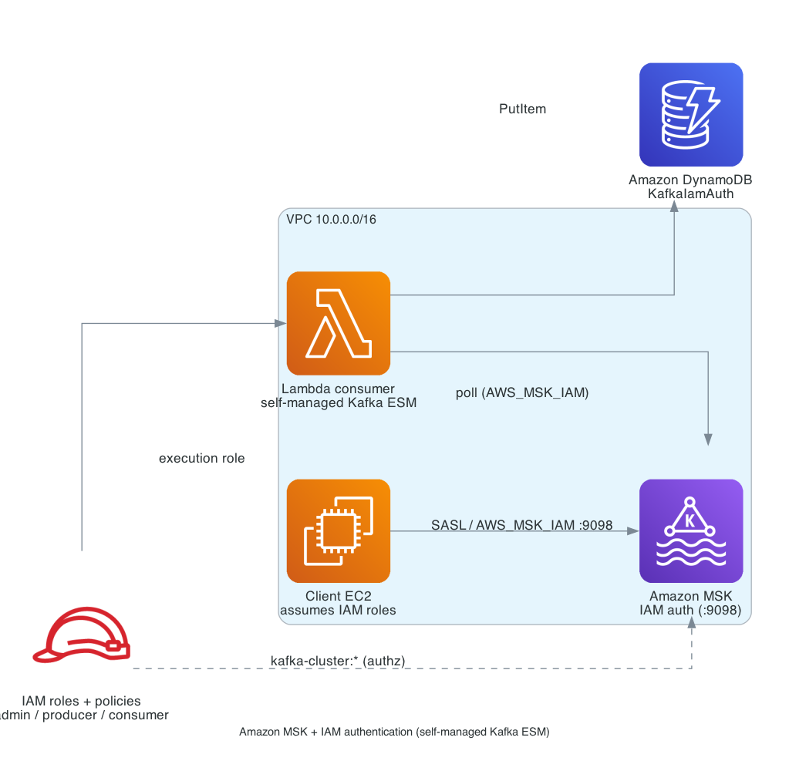

# kafka-lambda-oauth-java-sam / iam_auth
# Java AWS Lambda consumer for Amazon MSK via a self-managed Kafka event source with IAM_AUTH

> **Under development.** This variant uses the AWS Lambda **`IAM_AUTH`** auth type for a **self-managed** Kafka event source, which isn't generally available yet. For the fully-verified reference variant, see [`oauthbearer_auth`](../oauthbearer_auth).

A Lambda function that consumes from an **Amazon MSK cluster with IAM authentication**. Instead of the native MSK event source, the cluster is declared to Lambda as a **self-managed** Kafka event source pointed at MSK's **IAM bootstrap endpoint (`:9098`)** with the **`IAM_AUTH`** auth type (see the "Kafka OAuth & IAM Testing Manual", Route B). The function parses each Kafka message and writes its fields plus Kafka metadata to Amazon DynamoDB.

## Why MSK (not the 3 EC2 brokers)
`IAM_AUTH` is `AWS_MSK_IAM`, a server-side capability of Amazon MSK. Self-managed EC2 brokers can't validate it, so this variant provisions an **MSK cluster** while the sibling variants use self-managed EC2 brokers. Authorization is by **IAM policy** (`kafka-cluster:*` actions), not Kafka ACLs.

## Architecture



## Files
- `MSKAndClientEC2.yaml` - CloudFormation: MSK (IAM) cluster, a client EC2 instance, and three IAM client roles (admin/producer/consumer).
- `kafka_event_consumer_function/` - the Java consumer (writes to DynamoDB).
- `kafka_json_apps/` - Datafaker JSON producer/consumer (built with `aws-msk-iam-auth`).
- `scripts/` - `refresh_token.sh` (writes an AWS_MSK_IAM client.properties per role), `admin_create_topic.sh`, `producer_send.sh`, `consumer_receive.sh`, and negative tests.
- `scripts/deploy_lambda_iam_cli.sh` - deploys the Lambda + `IAM_AUTH` event source via the AWS CLI.
- `template_original.yaml` - SAM template for the function, its `IAM_AUTH` event source mapping, and the DynamoDB table. The client's UserData writes `template.yaml` from it with this environment's values.

## Identity & authorization model
No Cognito, no Kafka ACLs. MSK IAM authorization is enforced by IAM policies attached to each role; the client selects its role via `awsRoleArn` in the JAAS config:

| Role | IAM role (default) | kafka-cluster permissions |
|---|---|---|
| Admin | `<stack>-kafka-admin` | `*` (create topics, read/write, groups) |
| Producer | `<stack>-kafka-producer` | Connect, DescribeTopic, WriteData |
| Consumer | `<stack>-kafka-consumer` | Connect, DescribeTopic, ReadData, Describe/AlterGroup |
| Lambda poller | the function's execution role | Connect, DescribeTopic, ReadData, Describe/AlterGroup |

Each client's `client.properties` uses:
```properties
security.protocol=SASL_SSL
sasl.mechanism=AWS_MSK_IAM
sasl.jaas.config=software.amazon.msk.auth.iam.IAMLoginModule required awsRoleArn="<role arn>" awsStsRegion="<region>";
sasl.client.callback.handler.class=software.amazon.msk.auth.iam.IAMClientCallbackHandler
```
MSK presents a publicly-trusted TLS certificate, so no truststore / `SERVER_ROOT_CA_CERTIFICATE` is needed.

## Deploy
1. Deploy `MSKAndClientEC2.yaml` (CloudFormation). MSK cluster creation takes ~20-30 minutes. Wait for `CREATE_COMPLETE`. The stack waits for the client instance's setup to finish (it signals CloudFormation when done), so the client is ready as soon as the stack is.
2. Connect to the client EC2 (`KafkaClientInstance`) via EC2 Instance Connect. The client already created the topic (`cat topic_creator_output.txt`).
3. Build and deploy the Lambda function and its event source mapping with AWS SAM. The client's UserData already wrote `template.yaml`, filling in the IAM bootstrap brokers, subnets, security group, topic, and cluster name, so accept the defaults at every prompt:
   ```bash
   # AWS_REGION and STACK_NAME are read from ~/kafka_oauth.env, written at boot
   cd ~/serverless-patterns/kafka-lambda-oauth-java-sam/iam_auth
   sam build
   sam deploy --capabilities CAPABILITY_IAM --no-confirm-changeset --no-disable-rollback --region "$AWS_REGION" --stack-name "$STACK_NAME-sam" --guided
   ```

   The template creates the DynamoDB table (`<stack-name>-sam-messages`), grants the execution role `kafka-cluster` read access on the cluster, topic and group, and creates the event source mapping with `{Type: IAM_AUTH}`.

   SAM support for these authentication types arrived in SAM translator 1.114.0. CloudFormation runs that transform during `sam deploy`, so build and deploy work today, but the SAM CLI still bundles an older translator: skip `sam validate` until it catches up, because it rejects them.

   Alternatively, `bash scripts/deploy_lambda_iam_cli.sh` deploys the same consumer with the AWS CLI, under its own names (`<stack-name>-consumer`, `<stack-name>-messages`). The commands below use the SAM names.

## Test
```bash
FN=$(aws cloudformation describe-stacks --stack-name "$STACK_NAME-sam" \
  --query "Stacks[0].Outputs[?OutputKey=='LambdaKafkaConsumerJavaFunction'].OutputValue" --output text)
aws lambda list-event-source-mappings --function-name "$FN" \
  --query 'EventSourceMappings[].[UUID,State,LastProcessingResult]' --output table
bash scripts/producer_send.sh $KAFKA_TOPIC 10
aws dynamodb scan --table-name "$STACK_NAME-sam-messages" --max-items 5
```
Negative tests: `bash scripts/bad_invalid_credentials.sh` and `bash scripts/bad_unauthorized_operations.sh`.

## Cleanup
Run `sam delete --stack-name "$STACK_NAME-sam"` to remove the function, event source mapping, execution role, and DynamoDB table, then delete the CloudFormation stack (deleting the MSK cluster takes a while). If you used the CLI deploy instead, run `bash scripts/teardown_lambda_cli.sh`.
