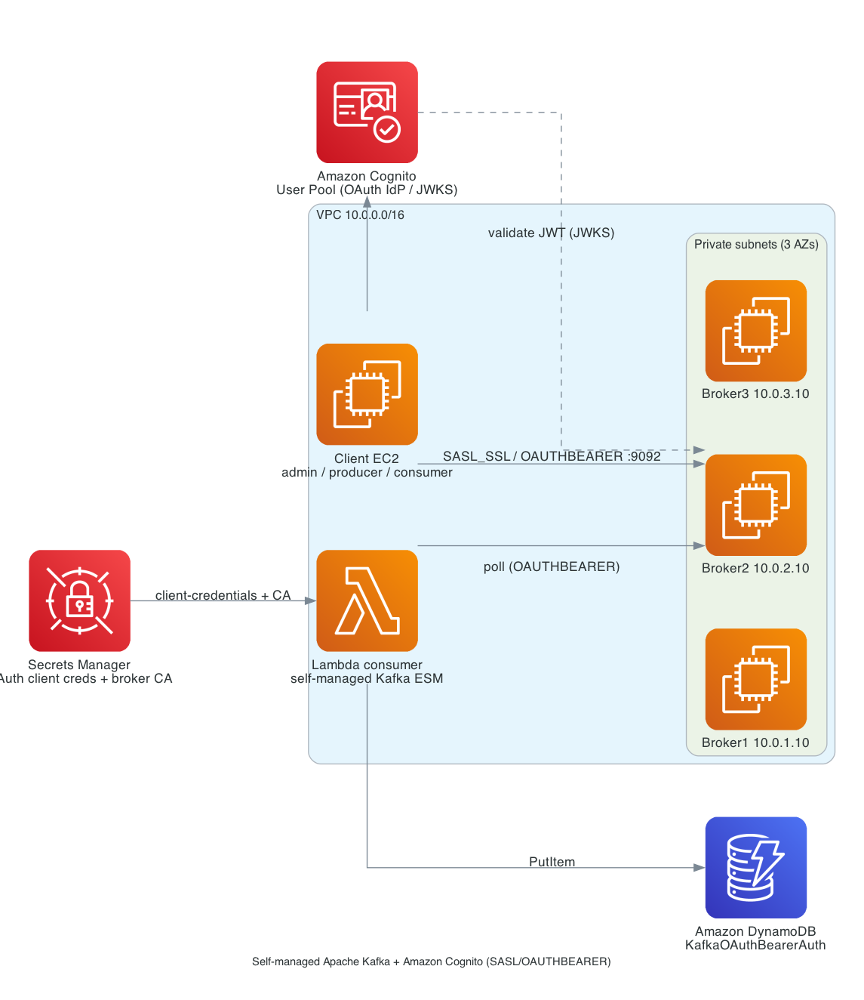

# kafka-lambda-oauth-java-sam / oauthbearer_auth
# Java AWS Lambda consumer for a self-managed Apache Kafka cluster with OAuth (SASL/OAUTHBEARER) authentication

A Lambda function consumes from a **self-managed Apache Kafka** cluster (3 brokers on Amazon EC2, KRaft mode) that authenticates clients with **SASL/OAUTHBEARER**, using an **Amazon Cognito User Pool** as the OAuth 2.0 identity provider. The function parses each Kafka message and writes its fields plus the Kafka metadata to **Amazon DynamoDB**.

It is the self-managed-Kafka + OAuth counterpart of the [`msk-lambda-iam-java-sam`](https://github.com/aws-samples/serverless-patterns/tree/main/msk-lambda-iam-java-sam) pattern (Amazon MSK with IAM auth).

> This is the `oauthbearer_auth` variant. Its siblings for the other self-managed Kafka event-source auth types (`iam_auth`, `iam_oauthbearer_auth`) sit alongside it under `kafka-lambda-oauth-java-sam`.

Files and folders:

- `kafka_event_consumer_function/src/main/java` - Code for the application's Lambda function (parses each Kafka message and writes it to DynamoDB).
- `kafka_event_consumer_function/src/test/java` - Unit tests for the application code.
- `kafka_json_apps` - Standalone Java producer/consumer sample apps (Datafaker JSON) used from the client EC2 instance.
- `scripts` - Helper scripts installed on the client EC2 instance (token refresh, admin/producer/consumer, negative tests).
- `events` - Invocation events you can use to invoke the function locally.
- `template_original.yaml` - SAM template for the function, its `OAUTHBEARER_AUTH` event source mapping, and the DynamoDB table. The client's UserData writes `template.yaml` from it with this environment's values.
- `scripts/deploy_lambda_oauth_cli.sh` - Deploys the Lambda function and its self-managed Kafka OAUTHBEARER event source via the AWS CLI.
- `KafkaBrokersCognitoClientEC2.yaml` - A CloudFormation template that deploys the self-managed Kafka cluster (3 broker EC2 instances), an Amazon Cognito User Pool, and a client EC2 machine with all pre-requisites installed, so you can build, deploy and test the Lambda function.

Important: this application uses various AWS services and there are costs associated with these services after the Free Tier usage - please see the [AWS Pricing page](https://aws.amazon.com/pricing/) for details. You are responsible for any AWS costs incurred. No warranty is implied in this example.

## Architecture



## Requirements

* [Create an AWS account](https://portal.aws.amazon.com/gp/aws/developer/registration/index.html) if you do not already have one and log in. The IAM user that you use must have sufficient permissions to make necessary AWS service calls and manage AWS resources.
* Your account must be **allowlisted** for the self-managed Kafka event-source `OAUTHBEARER_AUTH` type (the CLI deploy step depends on it).

## Run the CloudFormation template to create the Kafka cluster, Cognito User Pool and client EC2 machine

Deploy `KafkaBrokersCognitoClientEC2.yaml` from the AWS CloudFormation console (or CLI). There are **no password parameters** - the three role users' passwords are generated into AWS Secrets Manager. You may optionally override the usernames (`AdminUsername`, `ProducerUsername`, `ConsumerUsername`), the Java version, the Kafka download URL, the topic name, and (when deploying from your own fork) `ServerlessLandGithubLocation` and `ServerlessLandGithubBranch`. Put only the repository URL in `ServerlessLandGithubLocation` and the branch name in `ServerlessLandGithubBranch` (default `main`) - don't append `-b <branch>` to the URL.

Wait for the stack to reach `CREATE_COMPLETE`. It creates a VPC (1 public / 3 private subnets, NAT), 3 Kafka broker EC2 instances, an Amazon Cognito User Pool (+ domain, resource server, `client_credentials` app client, and three users), and a client EC2 instance with Java, Maven, Docker, the AWS CLI, the AWS SAM CLI, Kafka CLI tools, the built producer/consumer apps and the helper scripts installed.

* [Connect to the client EC2 machine] - Once the stack is created, go to the EC2 console, select `KafkaClientInstance`, and use **"Connect using EC2 Instance Connect"**. (The private brokers have no public IP - reach them, if needed, with **"Connect using EC2 Instance Connect Endpoint"**.) The stack doesn't reach `CREATE_COMPLETE` until the client's UserData has finished (downloading Kafka, building the apps, creating the topic and ACLs) and signalled CloudFormation, so the client is ready as soon as the stack is. If setup fails, the stack fails too - see `/var/log/kafka-client-setup.log` on the instance, or the stack events.

* [Check the topic + ACL bootstrap] - On the client instance (in `/home/ec2-user`) run `cat bootstrap_acls_output.txt`. You should see the topic created and the producer/consumer ACLs applied. If it shows an error (e.g. the brokers were not ready yet), re-run `bash scripts/admin_create_topic.sh $KAFKA_TOPIC`.

## Authentication and authorization model

| Role | Cognito user (default) | Kafka principal | Allowed |
|---|---|---|---|
| Admin | `kafka-admin` | `User:kafka-admin` | Super user - create topics/partitions, manage ACLs |
| Producer | `kafka-producer` | `User:kafka-producer` | `WRITE` to topics only |
| Consumer | `kafka-consumer` | `User:kafka-consumer` | `READ` from topics + `READ` on consumer groups |
| Lambda poller | `client_credentials` app client | `User:<client-id>` | Super user (machine identity for the event source) |

Each user's password is generated into Secrets Manager. `scripts/refresh_token.sh <role>` fetches that role's password, exchanges it for a Cognito access token (`USER_PASSWORD_AUTH`), and writes a per-role `client.properties`:

```properties
bootstrap.servers=<broker IPs:9092>
security.protocol=SASL_SSL
sasl.mechanism=OAUTHBEARER
ssl.truststore.location=<PKCS12 truststore>
ssl.truststore.password=changeit
ssl.truststore.type=PKCS12
sasl.login.callback.handler.class=io.strimzi.kafka.oauth.client.JaasClientOauthLoginCallbackHandler
sasl.jaas.config=org.apache.kafka.common.security.oauthbearer.OAuthBearerLoginModule required oauth.access.token="<JWT>" ;
```

## Test the cluster with the producer, consumer and admin clients

From `/home/ec2-user` on the client EC2 instance:

* **Admin - create a topic** (only the admin user is authorized):
  ```bash
  bash scripts/admin_create_topic.sh <topic-name> [partitions]
  ```
* **Producer - send Faker-generated JSON** (`firstName`, `lastName`, `streetAddress`, `apartmentNumber`, `city`, `state`, `zip`, `phoneNumber`, `email`):
  ```bash
  bash scripts/producer_send.sh <topic-name> <number-of-messages>
  ```
* **Consumer - receive and pretty-print each message**:
  ```bash
  bash scripts/consumer_receive.sh <topic-name> [group-id]
  ```

### Negative tests (bad actors)

* Invalid credentials / token: `bash scripts/bad_invalid_credentials.sh`
* Valid user, unauthorized operation (producer creates a topic, consumer produces, producer consumes - all denied): `bash scripts/bad_unauthorized_operations.sh [topic-name]`

## Deploy the Lambda consumer

### Deploy with AWS SAM

The client's UserData already wrote `template.yaml` from `template_original.yaml`, filling in the broker endpoints, subnets, security group, topic, and the ARNs of two secrets the CloudFormation stack owns:

* `<stack-name>-poller-oauth-creds` holds the poller app client's `oauthClientId`, `oauthClientSecret` and `oauthTokenEndpointUrl`, built from the Cognito resources at stack creation.
* `<stack-name>-broker-ca` holds the brokers' self-signed certificate in its `certificate` field. The client writes it at boot from `/home/ec2-user/kafka.crt`.

Build and deploy from this directory on the client EC2 instance, accepting the defaults at every prompt:

```bash
# AWS_REGION and STACK_NAME are read from ~/kafka_oauth.env, written at boot
cd ~/serverless-patterns/kafka-lambda-oauth-java-sam/oauthbearer_auth
sam build
sam deploy --capabilities CAPABILITY_IAM --no-confirm-changeset --no-disable-rollback --region "$AWS_REGION" --stack-name "$STACK_NAME-sam" --guided
```

The template creates the DynamoDB table (`<stack-name>-sam-messages`) and the event source mapping with `OAUTHBEARER_AUTH`, `OAUTHBEARER_SCOPE` (`kafka/consume`), `SERVER_ROOT_CA_CERTIFICATE`, and the VPC subnets and security group. SAM grants the execution role `secretsmanager:GetSecretValue` on both secrets and the network-interface permissions on its own.

SAM support for these authentication types arrived in SAM translator 1.114.0. CloudFormation runs that transform during `sam deploy`, so build and deploy work today, but the SAM CLI still bundles an older translator: skip `sam validate` until it catches up, because it rejects them.

Wait for the event source mapping to reach `Enabled`:

```bash
FN=$(aws cloudformation describe-stacks --stack-name "$STACK_NAME-sam" \
  --query "Stacks[0].Outputs[?OutputKey=='LambdaKafkaConsumerJavaFunction'].OutputValue" --output text)
aws lambda list-event-source-mappings --function-name "$FN" \
  --query 'EventSourceMappings[].[UUID,State,LastProcessingResult]' --output table
```

### Alternative: deploy with the AWS CLI

`deploy_lambda_oauth_cli.sh` deploys the same consumer with `aws lambda create-event-source-mapping`, under its own names (`<stack-name>-consumer`, `<stack-name>-messages`) and with its own copies of the two secrets (`<stack-name>-consumer-oauth-creds`, `<stack-name>-consumer-broker-ca`). The commands below use the SAM names.

```bash
bash scripts/deploy_lambda_oauth_cli.sh
```

## Test the sample application end to end

Produce some messages, then confirm the function consumed them and wrote them to DynamoDB:

```bash
bash scripts/producer_send.sh $KAFKA_TOPIC 10
```

* **CloudWatch Logs**: the function logs each Kafka message (topic, partition, offset, timestamp, timestampType, decoded key/value). A single invocation receives a batch of messages as a map keyed by `topic-partition`; the key and value of each message are base64-encoded and are decoded by the handler.
* **DynamoDB**: check the `<stack-name>-sam-messages` table - each item is keyed by `topicPartition` (partition key) + `offset` (sort key) and carries the Kafka metadata plus each field of the JSON payload:
  ```bash
  aws dynamodb scan --table-name "$STACK_NAME-sam-messages" --max-items 5
  ```

## Test the function locally

`sam local invoke` runs the function in a container on the client instance. A local run must not touch the real table, so test against [DynamoDB Local](https://docs.aws.amazon.com/amazondynamodb/latest/developerguide/DynamoDBLocal.html) instead. When `sam local invoke` runs the function it sets `AWS_SAM_LOCAL=true`, and the handler then writes to `http://dynamodb-local:8000` rather than DynamoDB; deployed functions never see that variable.

From this directory on the client EC2 instance:

```bash
bash scripts/local_dynamodb.sh          # starts DynamoDB Local and creates the table in it
sam build
sam local invoke --event events/event.json --docker-network sam-local
```

`local_dynamodb.sh` runs DynamoDB Local in Docker on a network called `sam-local` and creates the same table the template defines (`<stack-name>-sam-messages`). `--docker-network sam-local` puts the function's container on that network so the handler can reach it. Check what the function wrote with the `aws dynamodb scan --endpoint-url http://localhost:8000 ...` command the script prints. DynamoDB Local keeps its data in memory; `docker rm -f dynamodb-local` stops it and discards it.

## Cleanup

1. Delete the SAM stack, which removes the function, event source mapping, execution role, and DynamoDB table:
   ```bash
   sam delete --stack-name "$STACK_NAME-sam"
   ```
   If you used the CLI deploy instead, run `bash scripts/teardown_lambda_cli.sh`.

2. Delete the CloudFormation stack (Kafka brokers, Cognito User Pool, client EC2, and the two secrets above) from the console. If deletion fails, retry with Force Delete - ENIs created by the Lambda event source in the VPC can delay VPC deletion.

3. (Optional) Remove the Kafka download/cert cache bucket, which is created outside the stack and reused across redeploys:
   ```bash
   aws s3 rb "s3://kafka-oauth-cache-$(aws sts get-caller-identity --query Account --output text)-<region>" --force
   ```
