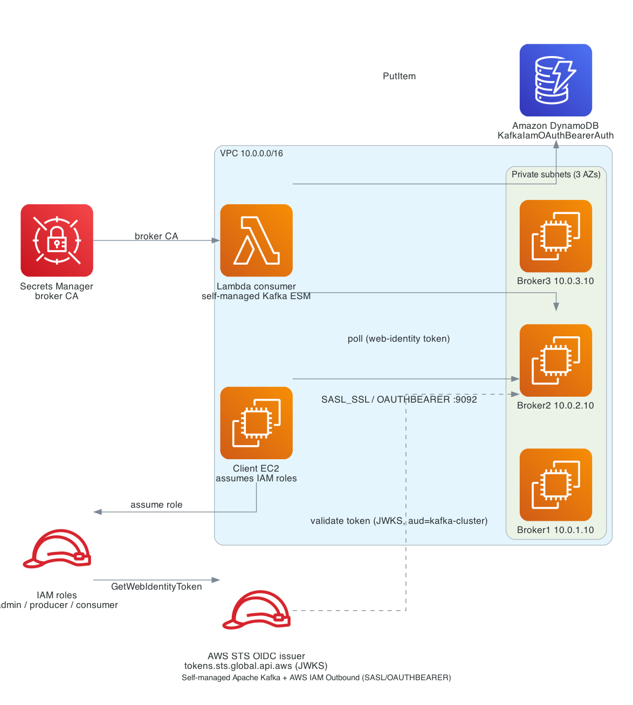

# kafka-lambda-oauth-python-sam / iam_oauthbearer_auth
# Python AWS Lambda consumer for a self-managed Apache Kafka cluster with IAM Outbound (SASL/OAUTHBEARER) authentication

This Lambda function consumes from a **self-managed Apache Kafka** cluster (3 brokers on EC2, KRaft) that authenticates clients with **SASL/OAUTHBEARER**. What differs from the Cognito variant is the token: here it is an **AWS IAM Outbound Identity Federation web-identity (OIDC) token**, not a token from an external IdP. There is **no Cognito/Keycloak** and **no client secret** — every identity is an AWS IAM role, federated outward as an OIDC token that the brokers validate against the **AWS STS OIDC JWKS** endpoint. The function parses each Kafka message and writes its fields plus Kafka metadata to Amazon DynamoDB.

## What "IAM Outbound" is
AWS mints a signed OIDC JWT from an IAM role via `sts:GetWebIdentityToken`. The token's issuer is the account's AWS STS Outbound Identity Federation issuer:

- **Issuer**: `https://<uuid>.tokens.sts.global.api.aws`
- **JWKS**: `https://<uuid>.tokens.sts.global.api.aws/.well-known/jwks.json`
- **Audience**: required (`kafka-cluster` here)

The `<uuid>` is account-specific. Enable federation with `aws iam enable-outbound-web-identity-federation`, then read the issuer with `aws iam get-outbound-web-identity-federation-info`. The brokers trust that issuer/JWKS and require the audience. Compared with the Cognito variant: no IdP to run, no secret to store, and audience checking is **enabled** (Cognito had none).

## Architecture



## Files
- `kafka_event_consumer_function/` - the Python consumer (`app.lambda_handler`, writes to DynamoDB).
- `kafka_json_apps/` - Python producer/consumer sample apps (kafka-python + Faker).
- `scripts/` - `refresh_token.sh` (mints a web-identity token per role), `admin_create_topic.sh`, `producer_send.sh`, `consumer_receive.sh`, and negative tests.
- `template_original.yaml` - SAM template for the function, its `IAM_OAUTHBEARER_AUTH` event source mapping, and the DynamoDB table. The client's UserData writes `template.yaml` from it with this environment's values.
- `scripts/deploy_lambda_oauth_cli.sh` - deploys the Lambda + `IAM_OAUTHBEARER_AUTH` event source via the AWS CLI.
- `KafkaBrokersClientEC2.yaml` - CloudFormation: the 3-broker cluster, three IAM client roles, and the client EC2 machine.

## Identity & authorization model
No Cognito. Four AWS IAM identities, each federated to a distinct Kafka principal (the token `sub`):

| Role | IAM role (default) | Allowed |
|---|---|---|
| Admin | `<stack>-kafka-admin` | topic/ACL management (via the brokers' internal PLAINTEXT listener, where `ANONYMOUS` is a super user) |
| Producer | `<stack>-kafka-producer` | `WRITE` to the topic |
| Consumer | `<stack>-kafka-consumer` | `READ` from the topic + consumer group |
| Lambda poller | the function's execution role | consumes via the event source |

Each interactive client **assumes** its role and mints a web-identity token (`refresh_token.sh <role>`). The token subject isn't known until the token is minted, so `admin_create_topic.sh` bootstraps the topic and ACLs over the brokers' **internal PLAINTEXT listener** (no token needed) and derives the producer/consumer principals at runtime by decoding the token `sub`.

## Deploy
1. Deploy `KafkaBrokersClientEC2.yaml` (CloudFormation). Optionally set `OutboundIssuerUrl` (leave blank to auto-enable federation and look it up at broker boot) and `OutboundAudience` (default `kafka-cluster`). Wait for `CREATE_COMPLETE`. The stack waits for the client instance's setup (which itself waits for the brokers) to finish, so everything is ready as soon as the stack is.
2. Connect to the client EC2 (`KafkaClientInstance`) via EC2 Instance Connect.
3. Build and deploy the Lambda function and its event source mapping with AWS SAM. The client's UserData already wrote `template.yaml`, filling in the broker endpoints, subnets, security group, topic, audience, the broker CA secret (`<stack-name>-broker-ca`), and the execution role's ARN, both owned by the CloudFormation stack, so accept the defaults at every prompt:
   ```bash
   # AWS_REGION and STACK_NAME are read from ~/kafka_oauth.env, written at boot
   cd ~/serverless-patterns/kafka-lambda-oauth-python-sam/iam_oauthbearer_auth
   sam build
   sam deploy --capabilities CAPABILITY_IAM --no-confirm-changeset --no-disable-rollback --region "$AWS_REGION" --stack-name "$STACK_NAME-sam" --guided
   ```

   The template creates the DynamoDB table (`<stack-name>-sam-messages`) and the event source mapping with `IAM_OAUTHBEARER_AUTH` + `OAUTHBEARER_AUDIENCE` + `SERVER_ROOT_CA_CERTIFICATE`.

   The function runs as `LambdaConsumerRole` from the CloudFormation stack, which holds `sts:GetWebIdentityToken` and the network and secret permissions; the SAM template only attaches DynamoDB write access to it. The poller's token `sub` is that role's ARN, and the brokers authorize it through Kafka ACLs, so the role is created up front and the client grants those ACLs at boot. A plain `sam deploy --guided` works, because the template creates no named IAM resources.

   SAM support for these authentication types arrived in SAM translator 1.114.0. CloudFormation runs that transform during `sam deploy`, so build and deploy work today, but the SAM CLI still bundles an older translator: skip `sam validate` until it catches up, because it rejects them.

   Alternatively, `bash scripts/deploy_lambda_oauth_cli.sh` deploys the same consumer with the AWS CLI, under its own names (`<stack-name>-consumer`, `<stack-name>-messages`). The commands below use the SAM names.

## Test
```bash
FN=$(aws cloudformation describe-stacks --stack-name "$STACK_NAME-sam" \
  --query "Stacks[0].Outputs[?OutputKey=='LambdaKafkaConsumerPythonFunction'].OutputValue" --output text)
aws lambda list-event-source-mappings --function-name "$FN" \
  --query 'EventSourceMappings[].[UUID,State,LastProcessingResult]' --output table
bash scripts/producer_send.sh $KAFKA_TOPIC 10
aws dynamodb scan --table-name "$STACK_NAME-sam-messages" --max-items 5
```
Negative tests: `bash scripts/bad_invalid_credentials.sh` and `bash scripts/bad_unauthorized_operations.sh`.

## Known limitation: 5-minute token lifetime

AWS Outbound web-identity tokens are short-lived (**~300 seconds**), and authentication is validated per token, so:
- The Lambda `IAM_OAUTHBEARER_AUTH` poller must re-mint a token every <5 min. If a refresh gap occurs, the mapping can trip to `Disabled` with `LastProcessingResult: SASL authentication failed`. Re-enable it to recover:
  ```bash
  aws lambda update-event-source-mapping --uuid <uuid> --enabled
  ```
- `refresh_token.sh` writes a **static** token, and the Python (kafka-python) producer/consumer supply that pre-minted token without refreshing it, so a `consumer_receive.sh` left running **longer than ~5 minutes will drop** with an auth error. Short produce/consume runs each mint a fresh token, so they're unaffected — just re-run for another session.

## Test the function locally

`sam local invoke` runs the function in a container on the client instance. A local run must not touch the real table, so test against [DynamoDB Local](https://docs.aws.amazon.com/amazondynamodb/latest/developerguide/DynamoDBLocal.html) instead. When `sam local invoke` runs the function it sets `AWS_SAM_LOCAL=true`, and the handler then writes to `http://dynamodb-local:8000` rather than DynamoDB; deployed functions never see that variable.

From this directory on the client EC2 instance:

```bash
bash scripts/local_dynamodb.sh          # starts DynamoDB Local, creates the table, configures sam local
sam build
sam local invoke
```

`local_dynamodb.sh` runs DynamoDB Local in Docker on a network called `sam-local` and creates the same table the template defines (`<stack-name>-sam-messages`). It also sets `docker_network = "sam-local"` and `event = "events/event.json"` under `[default.local_invoke.parameters]` in `samconfig.toml`, so a plain `sam local invoke` puts the function's container on that network, where the handler can reach DynamoDB Local; the deploy settings in the same file are left alone. Re-run the script whenever DynamoDB Local isn't running, for example after the instance restarts. An error like `getaddrinfo ENOTFOUND dynamodb-local` means it isn't. Check what the function wrote with the `aws dynamodb scan --endpoint-url http://localhost:8000 ...` command the script prints. DynamoDB Local keeps its data in memory; `docker rm -f dynamodb-local` stops it and discards it.

## Cleanup

1. Delete the Lambda function the same way you created it. `sam delete` only removes what is in the SAM stack, and the teardown script only removes what the CLI script created, so use the one that matches your deploy:
   * **Deployed with SAM** (`sam deploy`): `sam delete` removes the function, its event source mapping, and the DynamoDB table. Its execution role and the broker-CA secret belong to the CloudFormation stack and go in step 2. Use the stack name you gave `sam deploy` if it wasn't `"$STACK_NAME-sam"`.
     ```bash
     sam delete --stack-name "$STACK_NAME-sam"
     ```
   * **Deployed with the CLI script** (`scripts/deploy_lambda_oauth_cli.sh`): the teardown script removes the function, its event source mapping, its execution role, the DynamoDB table, and the broker-CA secret it created.
     ```bash
     bash scripts/teardown_lambda_cli.sh
     ```

2. Delete the CloudFormation stack, which also deletes the SAM function's execution role and the broker-CA secret.

3. (Optional) Remove the S3 Kafka/cert cache bucket (`kafka-*-cache-<account>-<region>`), which is created outside the stack and reused across redeploys.
